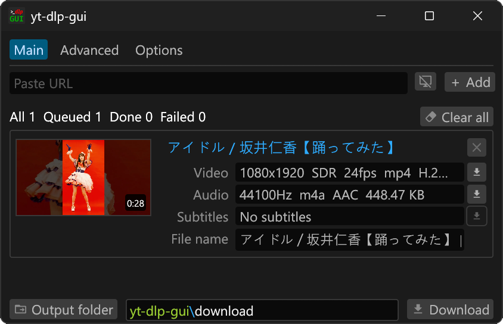

# yt-dlp-gui

- Front-end of [yt-dlp](https://github.com/yt-dlp/yt-dlp)
- Newly rebuilt version of [yt-dlp-gui](https://github.com/kannagi0303/yt-dlp-gui)
- Windows portable application
- Small single executable

### Screenshots

### Features

- Single and batch download workflow
- Video, audio, subtitle, chapter, and thumbnail options
- Format and subtitle picker
- Browser cookie and cookie file support
- yt-dlp config file support
- External downloader support with aria2
- Built-in dependency installer
- Localized interface

### Requirements

- [yt-dlp](https://github.com/yt-dlp/yt-dlp)
- [FFmpeg](https://ffmpeg.org/)

### Tool Sources

The built-in installer downloads optional tools from these release sources:

- `yt-dlp`: https://github.com/yt-dlp/yt-dlp
- `FFmpeg`: https://github.com/BtbN/FFmpeg-Builds
- `aria2`: https://github.com/aria2/aria2
- `Deno`: https://deno.com

### Authors

- かんなぎ (Kannagi)

  Thank you for loving [yt-dlp-gui](https://github.com/kannagi0303/yt-dlp-gui).

  The old project had many limits that were hard to compromise with, which made updates difficult for a long time. This version rebuilds the app in a new and better way.

  - For questions, suggestions, or discussions, please use Issues or Discussions. English, Chinese, and Japanese are OK.
  - 如有問題、建議或想討論的內容，歡迎透過 Issues 或 Discussions 與我聯繫。可以使用英文、中文或日文。
  - 質問、提案、または相談したいことがあれば、Issues や Discussions からご連絡ください。英語、中国語、日本語で対応できます。

## License

MIT
